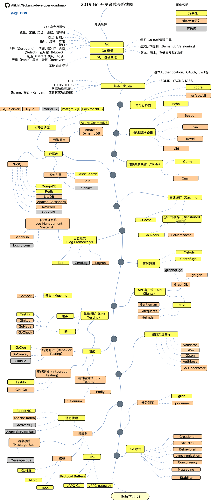

## 前言
> 不得不说Go语言真的是一门非常受广大开发者追崇与喜爱的语言，从网上随便搜索一下就可以发现许多优秀的社区，网站与文章。个人在学习一门新知识和语言之前都会先了解和收集一些相关的学习资料，然后选择合适自己的进行学习，该库是自己收集的Go相关学习资料、学习笔记、个人实战经验汇总希望能够帮助到想要学习和入门Go的小伙伴。

## Go 学习推荐社区/网站
#### [Go官网](https://golang.google.cn/)
#### [GoCN社区](https://gocn.vip/)
#### [go语言中文网](https://studygolang.com/)
#### [Go夜读](https://talkgo.org/)
#### [Laravel-go](https://learnku.com/go)
#### [Go语言编程](https://gobea.cn/)
#### [Go中文文档（TopGoer）](http://www.topgoer.com/)
#### [地鼠文档](http://topgoer.cn/)
#### [李文周的博客（Go语言学习之路）](https://www.liwenzhou.com/posts/Go/go_menu/)
#### [极客兔兔](https://geektutu.com/)
#### [煎鱼-Go实战教程](https://eddycjy.com/)
#### [Go 语言 - 编程导航](https://www.code-nav.cn/resources/golang)
#### [犬小哈教程](https://www.quanxiaoha.com/)
#### [Go 编程语言-常见问题 (FAQ)](https://golang.org/doc/faq)
#### [全栈编程](https://www.luboke.com/)
#### [Go编程时光](https://golang.iswbm.com/index.html)
#### [Go 语言教程-菜鸟教程](https://www.runoob.com/go/go-tutorial.html)
#### [Go 教程-W3Cschool](https://www.w3cschool.cn/go/)
#### [极客学院-Go相关教程](https://wiki.jikexueyuan.com/list/go/)
#### [mojotv 进阶系列](https://mojotv.cn/404#Golang)
#### [七牛云Go代理](https://goproxy.cn/?fr=topgoer)
#### [Go网址导航](https://hao.studygolang.com/)
#### [Go编程语言](https://go-zh.org/doc/)
#### [Go指南](https://tour.go-zh.org/list)
#### [Go语言编程-嗨客网](https://haicoder.net/golang/golang-tutorial.html)
#### [Learn Go with tests](https://studygolang.gitbook.io/learn-go-with-tests/)
#### [Golang标准库中文文档](http://www.golang.ltd/)

## Go Web开发学习指南
#### [使用Golang构建Web应用教程](https://github.com/astaxie/build-web-application-with-golang/blob/master/zh/preface.md)
#### [Go 实战：Web 入门](https://learnku.com/courses/go-basic/1.15) 

## Go学习路线教程
#### [Go 学习之路：Go 开发者博客、Go 微信公众号、Go 学习资料](https://github.com/talkgo/read)
#### [超全golang面试题合集+golang学习指南+golang知识图谱+入门成长路线](https://github.com/xiaobaiTech/golangFamily)
#### [Microsoft-开始使用Go](https://docs.microsoft.com/zh-cn/learn/paths/go-first-steps/)
#### [GO学习路线及资源分享](https://learnku.com/articles/55726)
#### [Go知识图谱（processOn脑图）](https://www.processon.com/view/link/5a9ba4c8e4b0a9d22eb3bdf0#map)
#### [Go阅读清单](https://github.com/qichengzx/gopher-reading-list-zh_CN)
#### [Go学习路线图](http://www.topgoer.com/开源/go学习线路图.html#路线图)
#### [Go语言如何进阶？](https://www.zhihu.com/question/399923003/answer/2262100997)

## Go学习书籍
#### Go并发编程实战 
#### Go语言实战 
#### 学习Go语言(Golang) 
#### [Go语言圣经（中文版）](https://books.studygolang.com/gopl-zh/) 
#### Go语言程序设计 
#### [Go语言标准库](https://books.studygolang.com/The-Golang-Standard-Library-by-Example/)
#### [Go语言编程](https://www.bookstack.cn/read/the-way-to-go_ZH_CN/eBook-directory.md)
#### [Go Web编程 ](https://gobea.cn/ebook/detail/ZyrG3Rr8.html)
#### [Go入门指南](https://www.bookstack.cn/books/the-way-to-go_ZH_CN)
#### [Go语言核心编程](https://book.douban.com/subject/30351288/)
#### [Go 语言高性能编程](https://geektutu.com/post/high-performance-go.html)
#### [Go语言高级编程](https://chai2010.gitbooks.io/advanced-go-programming-book/content/)
#### [The Little Go Book中文译本，中文正式名《Go简易教程》](https://github.com/songleo/the-little-go-book_ZH_CN)
#### [Go语言设计与实现](https://draveness.me/golang/)
#### [Golang修养之路](https://www.kancloud.cn/aceld/golang)

## 开发工具
#### [Visual Studio Code（免费）](https://code.visualstudio.com/Download)
##### VS Code中的Go拓展
[Go extension for VS Code](https://github.com/GolangFamily/vscode-go)

#### [LiteIDE](http://liteide.org/cn/)
> LiteIDE 是一款简单，开源，跨平台的 Go IDE

#### [Goland（付费）](https://www.jetbrains.com/go/download/#section=windows)

## Go优秀项目汇总
#### [GolangFamily](https://github.com/GolangFamily)

> Go优秀项目，优质学习资源收集

#### [中文版awesome-go](https://github.com/GolangFamily/golang-open-source-projects)

#### [Go优秀开源项目推荐](https://www.cnblogs.com/Can-daydayup/p/15178348.html)
#### [Go优秀项目汇总-知乎](https://www.zhihu.com/question/48821269/answer/2049760553)

## Go学习路线图
#### Go语言基础知识点思维导图

#### Go知识图谱

[来源GoCN👉](https://www.processon.com/view/link/5a9ba4c8e4b0a9d22eb3bdf0#map)

#### Go学习路线图

[来源golang-developer-roadmap-cn👉](https://github.com/Quorafind/golang-developer-roadmap-cn)

